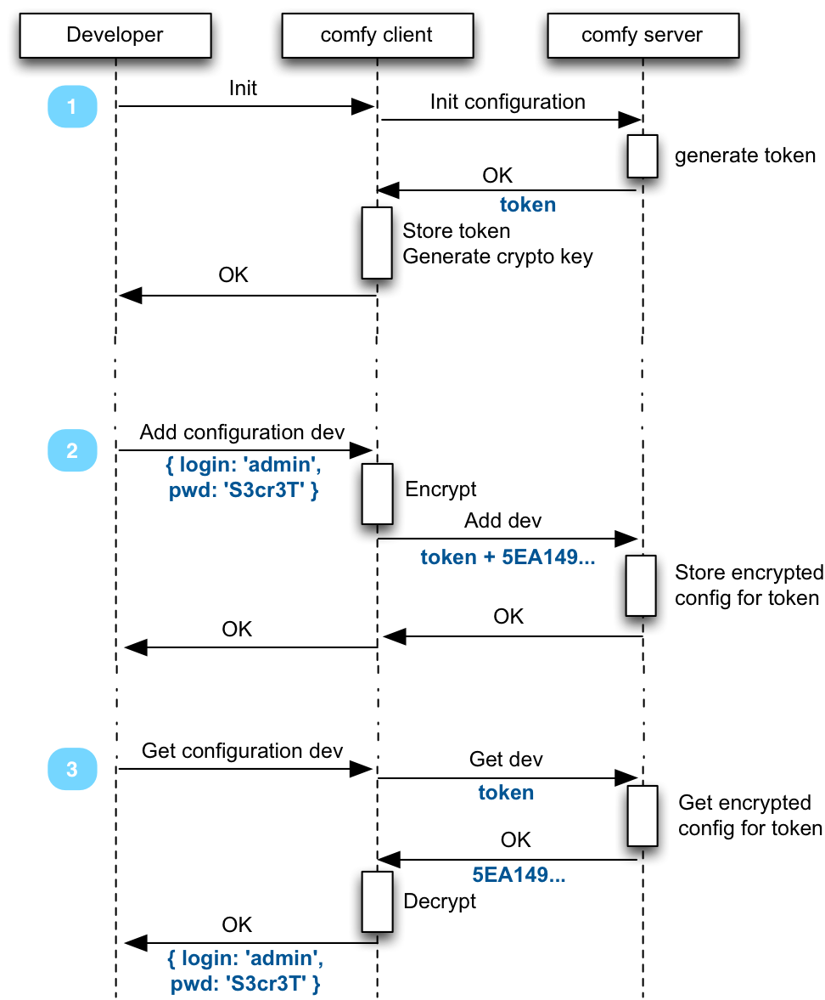

## The Problem: Managing Application Configuration

How do you store the configuration for a web application?

Most developers use configuration files (`config.json`, `parameters.yaml`, `root.xml`, etc). But these files should not be committed to source control (git), because they contain sensible information (db passwords, service credentials, etc), and because they can change with each developer. So developers usually commit fake config files (like `parameters.yml-dist`) and keep a real config file locally (and ignored by source control). This leads to problems when one developer adds a new key to the configuration but another developer doesn't know about it.

Another solution is to use environment variables. This makes sharing the configuration between developers and between environments even harder.

## The Solution

Comfygure proposes to solve that problem by storing configuration on a remote server (like a remote git), encrypted. A comfygure client knows how to read and write from that remote server, and decrypt the configuration to dump it locally.



Ultimately, this lets you execute the following command from any server (development, test, production):

```bash
> comfy get development --envvars
export LOGIN='admin';
export PASSWORD='S3cr3T';
```

Developers store the decryption key locally, allowing them to decrypt and/or update the configuration. In a similar fashion, CI servers can also check out the configuration with a simple decryption key, then build an artifact to be deployed to production.

Comfy handles environments (dev, test, staging, production, etc.), versioning, read/write permissions. It allows to dump the configuration to the format you like (env vars, json, yaml).

From a security standpoint, if the remote server is owned, the attacker can only access the encrypted data. Since the server never stores the decryption key, the attacker can't decrypt the configuration.

By default, the server is comfy.marmelab.com (run by marmelab), but it can be a server that you host yourself ([this repository contains the server code](https://github.com/marmelab/comfygure)).
